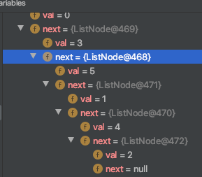

# LeetCode:Sort List



## 解决问题

题目简单直白，排序一个链表（我就喜欢这种），然后不会做😃。

题目要求保证O\(1\)的空间复杂度，这个就很XX了，如果不考虑时间空间复杂度的话很容易写出如下

```java
public ListNode sortList(ListNode head) {
    if (head == null) {
        return null;
    }
    ArrayList<ListNode> result = new ArrayList<>();
    while (head != null) {
        result.add(head);
        head = head.next;
    }
    result.sort((Comparator.comparingInt(o -> o.val)));
    for (int i = 0; i < result.size()-1; i++) {
        result.get(i).next = result.get(i+1);
    }
    result.get(result.size()-1).next = null;
    return result.get(0);
}
```

如果问我这个写法的时间和空间复杂度，我不知道- -因为result.sort（Java提供的数组排序方法）隐藏了太多细节，根据排序对象的特点JAVA会用不同的排序手段以提高性能。。文章的最后简要分析一下

分析一下高赞答案，说实话看了好久才看懂，而且懂了我也写不出来的那种= =

```java
public ListNode sortList(ListNode head) {
    ListNode dummy = new ListNode(0);
    dummy.next = head;
    int n = 0;
    while (head != null) {
        head = head.next;
        n++;
    }

    for (int step = 1; step < n; step <<= 1) {
        ListNode prev = dummy;
        ListNode cur = dummy.next;
        while (cur != null) {
            ListNode left = cur;
            ListNode right = split(left, step);
            cur = split(right, step);
            prev = merge(left, right, prev);
        }
    }

    return dummy.next;
}

private ListNode split(ListNode head, int step) {
    if (head == null) return null;

    for (int i = 1; head.next != null && i < step; i++) {
        head = head.next;
    }

    ListNode right = head.next;
    head.next = null;
    return right;
}

private ListNode merge(ListNode left, ListNode right, ListNode prev) {
    ListNode cur = prev;
    while (left != null && right != null) {
        if (left.val < right.val) {
            cur.next = left;
            left = left.next;
        } else {
            cur.next = right;
            right = right.next;
        }
        cur = cur.next;
    }

    if (left != null) cur.next = left;
    else if (right != null) cur.next = right;
    while (cur.next != null) cur = cur.next;
    return cur;
}
```

其实这是一个自底向上的归并排序，因为要求ListNode实现的原因稍微复杂了一点（需要有一个空的链表头，preNode和currentNode的指针等），相比top-bottom的原始归并排序，这个用了iterate而不是recursive的方法，这样可以保证空间复杂度满足要求\(至于是不是O（1）大家也在争论。。但是空间复杂度这个东西相比时间复杂度好像也不是特别引人关注。。总之iterate的方法比递归更节省内存就是了\)


插一嘴，对于递归的内存占用问过算法课的professor，prefessor说其实有很多对于递归内存的优化策略，所以在很多情况下递归从表现形式，逻辑上来说仍然是比较好的选择（比如Haskell大量运用了递归策略）


```java
for (int step = 1; step < n; step <<= 1)
```

这里step的意思是排序分组的数量（2，4，8，16），每次翻倍，第一轮保证每两个元素顺序是对的，第二轮保证每四个元素的顺序是对的。。。直到最后排序完成，这里需要逻辑处理最后一组数量不满的组，split（）作用是根据step以left分割这个链表并且返回当前分割的最后一个节点，merge（）则是排序left到right节点，然后和prev（指向排序好的最后一哥节点）合并，merge下面可以看到排序5，3，4，1，2的过程




单次合并需要O（n），根据step的原理需要进行log（n）次所以是个O（nlogn）的算法


再插一嘴，所有以对比为基础的排序算法时间复杂度不可能优于O（nlogn）！


## 关于Java中的Collections.sort和Arrays.sort

 上面自己的解法中用了ArrayList.sort方法，这里分析一下。ArrayList实现了List接口，List接口中又一个sort方法\(这里提一嘴Collection.sort其实走的也是list.sort这个方法，如图，只是没有指定实现类\)

```java
public static <T extends Comparable<? super T>> void sort(List<T> list) {
    list.sort(null);
}
```

再往下看，实际上最后list.sort把list转成数组后还是走的Arrays.sort，所以Array.sort相当于工具人，Collection.sort把最后排序的活都给Arrays.sort了，继续往下看Arrays.sort

```java
default void sort(Comparator<? super E> c) {
    Object[] a = this.toArray();
    Arrays.sort(a, (Comparator) c);
    ListIterator<E> i = this.listIterator();
    for (Object e : a) {
        i.next();
        i.set((E) e);
    }
}
```

Arrays.sort中所有的sort方法最后都外包给了DualPivotQuicksort.sort至此我们终于找到了冤大头DualPivotQuicksort类，这就是实现排序的方法类


其实排序算法可以混着用，比如插入排序在almost sorted数组或者比较短的数组中可以接近O（n）所以在排序过程中我们可以先用比如快排，归并等方法排到almost sorted后进行插入排序，提高性能


在DualPivotQuicksort类中就体现了这种思想，虽然类名叫DualPivotQuicksort，但是实际上用了不同的排序算法，可以看到有很多int的field都是为作threshold，表示在排序数量在这个阈值之内的话就用某些排序算法，至于这个阈值是怎么确定的。。。看论文把可能有答案这里不细究了

```java
/**
 * If the length of an array to be sorted is less than this
 * constant, Quicksort is used in preference to merge sort.
 */
private static final int QUICKSORT_THRESHOLD = 286;

/**
 * If the length of an array to be sorted is less than this
 * constant, insertion sort is used in preference to Quicksort.
 */
private static final int INSERTION_SORT_THRESHOLD = 47;
```



